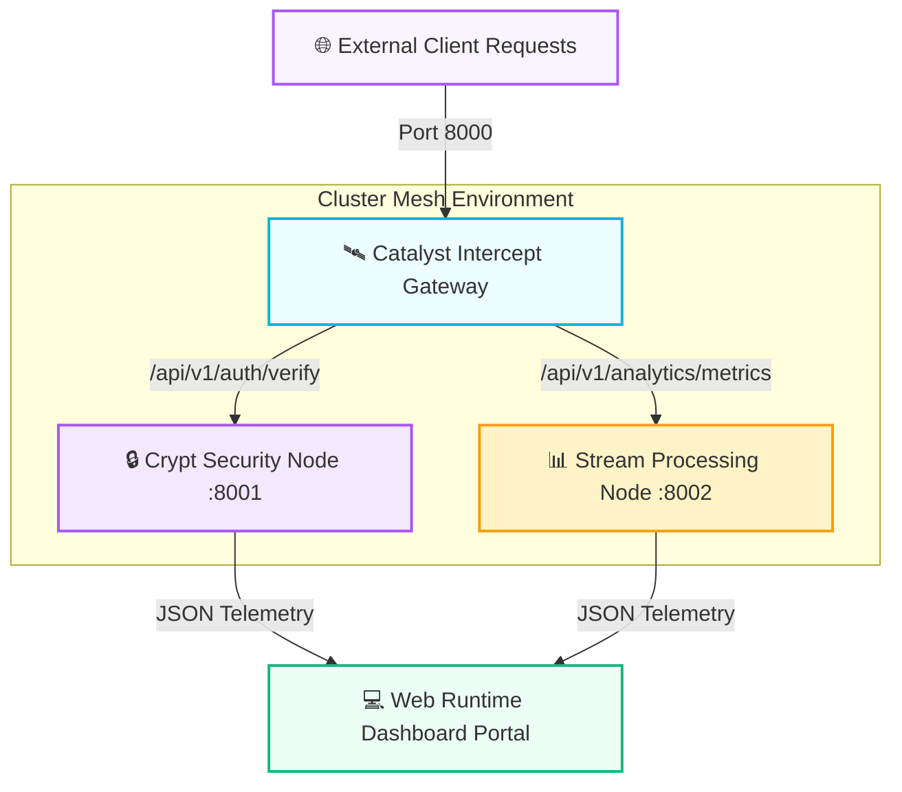

# 📊 CATALYST // Distributed Event-Streaming Cloud Mesh

<p align="left">
  <a href="https://github.com">
    
  </a>
  
  
  
</p>

Catalyst is an enterprise-grade distributed cloud infrastructure ecosystem engineered to simulate production-level container microservices networks. The platform coordinates an asynchronous, high-scale API gateway proxy layer with multi-threaded, encapsulated backend tracking engines—featuring a **Cryptographic Session Identity Node** and a **High-Throughput Stream Parsing Engine**—all synchronized seamlessly under a premium web telemetry analytics command console layout.

---

## ⚡ Key Architectural Capabilities

### 🎛️ Distributed Web Observability Matrix
* **Cyberpunk Grid Dashboard:** Crafted using semantic HTML5 grids, dark-mode atomic variables, and modern visual alignment cards.
* **Asynchronous Proxy Route Gates:** Leverages lightweight, non-blocking native socket compilation layers to direct server pathways smoothly across discrete internal networks.
* **Hardware-Accelerated Network Simulations:** Employs timeline keyframe CSS logic pipelines to map live inter-node resource transactions directly on browser surfaces.

### ⛓️ Enterprise Code Governance & Quality Systems
* **Supply-Chain Resilient Blueprint:** Built with 100% native platform libraries, eliminating unsafe third-party package rules to prevent cloud software exploits.
* **Continuous Quality Ingestion Gates:** Monitored automatically on every single code commit via robust GitHub Actions regression testing workflows.

---

## 🗺️ System Blueprint & Service Directory Topography



---

## 🛠️ Repository File Registry Matrix

<table>
  <thead>
    <tr>
      <th>Directory Structure Path</th>
      <th>Operational Component Type</th>
      <th>System Level Blueprint Function</th>
    </tr>
  </thead>
  <tbody>
    <tr>
      <td>📂 <code>.github/workflows/pipeline.yml</code></td>
      <td><kbd>DevOps / CI-CD</kbd></td>
      <td>Continuous Integration validation suite configuration</td>
    </tr>
    <tr>
      <td>📂 <code>gateway/router.py</code></td>
      <td><kbd>Core Routing</kbd></td>
      <td>Ingress proxy server controller handling network routing</td>
    </tr>
    <tr>
      <td>📂 <code>gateway/config.json</code></td>
      <td><kbd>Configuration</kbd></td>
      <td>Routing matrix endpoints mapping configurations file</td>
    </tr>
    <tr>
      <td>📂 <code>services/auth/identity.py</code></td>
      <td><kbd>Security Microservice</kbd></td>
      <td>Cryptographic verification token application runtime loop</td>
    </tr>
    <tr>
      <td>📂 <code>services/auth/security_rules.json</code></td>
      <td><kbd>Security Policy</kbd></td>
      <td>System transport encryption parameters configuration profile</td>
    </tr>
    <tr>
      <td>📂 <code>services/analytics/stream.py</code></td>
      <td><kbd>Data Microservice</kbd></td>
      <td>Concurrent big-data telemetry analytics pipeline loop</td>
    </tr>
    <tr>
      <td>📂 <code>services/analytics/thresholds.json</code></td>
      <td><kbd>Data Bounds</kbd></td>
      <td>Resource memory boundary rules and threshold triggers</td>
    </tr>
    <tr>
      <td>📂 <code>dashboard/index.html</code></td>
      <td><kbd>Frontend UI</kbd></td>
      <td>Glowing modern dark-mode system analytics control console UI</td>
    </tr>
    <tr>
      <td>📂 <code>tests/test_mesh.py</code></td>
      <td><kbd>QA Automation</kbd></td>
      <td>Architectural integration unit testing verification matrix</td>
    </tr>
  </tbody>
</table>

---

## 🖥️ Live Cluster Interface Diagnostics Panel

<div align="center">
  <table width="100%">
    <tr>
      <td bgcolor="#0f172a">
        <font color="#06b6d4"><strong>[INGRESS CHANNEL]</strong></font>
      </td>
      <td bgcolor="#0f172a">
        <font color="#a855f7"><strong>[TARGET SUBSYSTEM]</strong></font>
      </td>
      <td bgcolor="#0f172a">
        <font color="#f59e0b"><strong>[CLUSTER LIVE CAPACITY]</strong></font>
      </td>
      <td bgcolor="#0f172a">
        <font color="#10b981"><strong>[HEALTH]</strong></font>
      </td>
    </tr>
    <tr>
      <td bgcolor="#1e293b">🚀 <code>/api/v1/health</code></td>
      <td bgcolor="#1e293b">CATALYST_PROXY_GATEWAY</td>
      <td bgcolor="#1e293b">
        
      </td>
      <td bgcolor="#1e293b"><font color="#10b981"><strong>OPTIMAL</strong></font></td>
    </tr>
    <tr>
      <td bgcolor="#1e293b">🔒 <code>/api/v1/auth/verify</code></td>
      <td bgcolor="#1e293b">IDENTITY_SECURITY_NODE</td>
      <td bgcolor="#1e293b">
        
      </td>
      <td bgcolor="#1e293b"><font color="#10b981"><strong>SECURED</strong></font></td>
    </tr>
    <tr>
      <td bgcolor="#1e293b">📊 <code>/api/v1/analytics</code></td>
      <td bgcolor="#1e293b">TELEMETRY_STREAM_NODE</td>
      <td bgcolor="#1e293b">
        
      </td>
      <td bgcolor="#1e293b"><font color="#10b981"><strong>STABLE</strong></font></td>
    </tr>
  </table>
</div>

> 📋 **Active Operational Event Log Stream:**
> `[MESH NODE] Directing downstream JSON payload arrays to port :8002...`
> `[MESH NODE] Cryptographic token authorization verification process: SUCCESS (2.41ms)`

---

## 🔧 Production Setup & System Deployment Manual

### 1. Provision Local Workspace Nodes
Clone the architecture asset scripts into your local developer operational workspace:
```bash
git clone https://github.com
cd catalyst-cloud-mesh
```

### 2. Ignition: Deploy Infrastructure Cloud Nodes
Launch the internal service node processes inside separate terminal instances to activate network system listeners:

```bash
# Terminal Node 1: Spin up Proxy Routing Gateway
python gateway/router.py
```
```bash
# Terminal Node 2: Spin up Encryption Identity Services
python services/auth/identity.py
```
```bash
# Terminal Node 3: Spin up Stream Processing Analytics
python services/analytics/stream.py
```

### 3. Initialize the Monitoring Dashboard Control Center
1. Fire up any high-performance modern web browsing software.
2. Open your local web console by launching your dashboard source file: `dashboard/index.html`
3. The interactive, real-time microservices cloud control center panel will render instantly on screen.

---

## 📊 Enterprise Contribution Code Management Rules

To protect cluster code compile safety across all analytics pipelines, configuration patches must clear this specific development workflow:

```text
 ┌──────────────┐      ┌────────────────┐      ┌─────────────────┐      ┌──────────────┐
 │ Create Fork  │ ──►  │ Feature Branch │ ──►  │ Clear CI Rules  │ ──►  │ Pull Request │
 │  Repository  │      │ git checkout -b│      │  GitHub Actions │      │ Code Merged  │
 └──────────────┘      └────────────────┘      └─────────────────┘      └──────────────┘
```

1. **Isolate Code Scope:** Check out from main cleanly (`git checkout -b feature/throughput-optimization`).
2. **Execute Clean Git Hygiene:** Name commits professionally (e.g., `perf: optimize log aggregation loop memory footprints`).
3. **Pass Automation Verification:** Submit a Pull Request. Code will only merge once the automated GitHub Actions checks confirm complete compile safety.

---

## 📄 Open-Source Compliance & Licensing
Distributed under the open-source **MIT License**. Review the `LICENSE` file text fields for complete authorization contexts.

***
<p align="center">
  Architected and Engineered with ⚡ by <strong>Vishwajeet</strong> — Engineering resilient distributed cloud grids.
</p>
